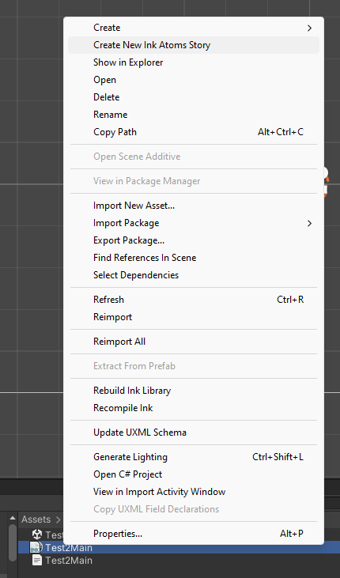
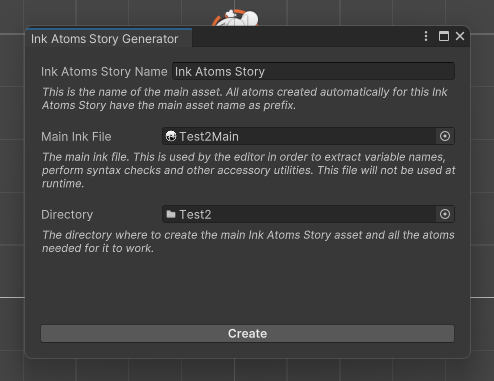

<!-- @formatter:off -->
# :atom: Ink Atoms

**Ink Atoms** is a package to easily integrate **Ink** in your projects using **Unity Atoms**.

[Ink](https://www.inklestudios.com/ink/) is a narrative scripting language and middleware aimed at writers, narrative designers and technical writers to manage stories in a game.

[Unity Atoms](https://github.com/unity-atoms/unity-atoms) is a set of tools to decouple components and produce a modular, debuggable and testable Unity project. It is particularly good when interactions between components can be expressed as (shared) variables and events, as story-driven games usually are.

## Installation

1. The package is available on the [openupm registry](https://openupm.com). You can install it via [openupm-cli](https://github.com/openupm/openupm-cli).

```sh
openupm add it.lemurivolta.ink-atoms
```

2. You can also install via git url by adding these entries in your **manifest.json**

```json
{
  "com.inkle.ink-unity-integration": "https://github.com/inkle/ink-unity-integration.git#upm",
  "it.lemurivolta.ink-atoms": "https://github.com/lemurivolta/ink-atoms.git#upm"
}
```

## System Requirements

# Overview

Ink projects are a set of files containing the text of a game, enriched with tags and instructions to provide the necessary interactivity. Ink gives its best when it is in complete control of both the textual contents and the high-level flow of the game.

Unity Atoms is a set of tools that revolves around the use of *atoms*, which are scriptable objects that represent atomic elements (data and events), accessible from the whole project. They provide a functional replacement for singleton instances and managers.

Ink Atoms builds on these elements, providing a structure for interacting inside Unity with Ink stories through Atoms. Its main advantages are:

- The ones that [Atoms already provide on its own](https://github.com/unity-atoms/unity-atoms?tab=readme-ov-file#motivation): **modularity, editability, better debugging**;
- **Asynchronous execution of commands** (Ink's external functions are synchronous only);
- **Less boilerplate**: it implements the code necessary to get Ink integrated inside of Unity, providing an opinionated yet flexible way of interacting with its systems;
- Provides a default structure for some features that are typically needed, like specially formatted command lines or tags to execute **custom code**.

# Initial configuration

To create the necessary asset(s), right-click on the Ink story to manage and select "Create New Ink Atoms Story".



This will open the creation window, with a set of reasonable defaults. The meaning of each entry is described in the box itself.



The creation will trigger upon clicking "Create". This will create the main asset, and also the set of all the necessary atoms. These atoms are visible under the "Atoms" foldout once the asset is created:


# Base usage

Once the asset has been created, a story can be started at any time. The Ink Atoms Story is not associated to a specific ink story (which allows, for example, to support multiple languages). To start the story, you can call the method `StartStory` of the asset:

```csharp
[SerializeField] private InkAtomsStory inkAtomsStory;
[SerializeField] private TextAsset enStory;
[SerializeField] private TextAsset itStory;

// ...

private void StartENStory() {
  inkAtomsStory.StartStory(enStory);
}
```

To continue the story you can invoke the event specified as **Continue Event** in the asset (under the "Atoms" foldout). The event takes a string as parameter, which represents [the flow](https://github.com/inkle/ink/blob/master/Documentation/RunningYourInk.md#multiple-parallel-flows-beta) to continue, or `null` to use the default flow (as it will be most of the time).

Ink Atoms uses the concept of "current step", which represents the current state of the story: the line to display, the choices available, the tags, and so on. This step is saved on the Unity Atom marked as **Story Step Variable**, and because of that it will produce the related change events.

Once a choice is presented, it can be chosen by raising the event marked as **Choice Event**. This data structure contains data both about the choice index and flow.

The Ink Atoms Story asset has a Debug more checkbox. If active, information about each step is printed on the console.

## Variables

One way to communicate between Unity and Ink projects is through *variables*. The ink story can write relevant data into variables that will be read by the game to display it in some form, or the game can write data into the ink variables to inform the story about choices and actions of the player.

The main interface is the Variable Listeners panel. A variable listener is a component that listens to changes in a variable to read or synchronize variable values between ink and Unity. There are multiple ways to handle variables, each of which can satisfy different needs.

### Match by name

This is the most used and basic way to use variables. It allows a variable to be fully synchronized between Unity and Ink: each time the specified variable is changed in ink, it's also written in the Unity Atom, and each time it's changed in the atom, it's also written back in Ink.

Since Ink is weakly typed, the Ink Atom uses the `VariableValue` type that wraps a generic value of type `object`.

This method could be used for example to synchronize the number of life points of the main character.

### Match by regex and list

This method listens to multiple variables at once, either by specifying a regular expression that matches with the variable name, or by providing an explicit list of variables to listen to.

Since there are multiple variables listened at once, an Atom Event is raised at every change, but no value is synchronized with atoms. Two different events are provided:

- *Variable Change Event* only provides the new value of the variable changed
- *Variable Pair Change Event* provides both the new and the old value

### Match by name (ink list)

This method is equivalent to the Match by name, but it's used for ink lists, and the value is written in a [value list](https://unity-atoms.github.io/unity-atoms/introduction/overview#value-lists) atom. This provides access to the single entries, and events corresponding to the add and removal.

## Calling code from Ink

Ink provides a built-in mechanism to call functions in the hosted environment, called *external functions*. This method has some limitations, namely that functions are strictly *synchronous*, but offer the advantage that they can return values to ink once executed, and can provide a fallback pure-ink implementation (which allows for an easy testing of a game in the Ink editor).

To overcome this limitation, the usually used approach is to have a convention between the ink writers and the unity implementation to mark lines that have to be interpreted as commands. Unity will stop execution for as long as needed to complete the action without advancing.

Another tool used to send data and commands are tags. They can both be used to describe a line (e.g.: a change in expression of the main character) but also to start an action (e.g.: the camera panning to a certain position).

All these three methods are supported in Ink Atom Story in similar ways. In all these situations, one must implement a class by extending a base class and extend all its parts.

### External Functions

There are three classes that can be implemented to create an external function, according to how it works.

- `ActionExternalFunction` for *synchronous* external functions that *do not need to return a value*,
- `FuncExternalFunction` for *synchronous* external functions that *need to return a value*, and finally
- `CoroutineExternalFunction` for *asynchronous* external functions that can optionally return a value (see limitations below).

In all cases, the steps are:

- Extend the base class:

```csharp
public class Test1PlaySoundExternalFunction : CoroutineExternalFunction {
  // ...
```

- Call the constructor with the name of the external function:

```csharp
    public Test1PlaySoundExternalFunction() : base("playSound") { }
```

- Override the `Call` method. According to the kind of base class, the method has a different signature:
    - `public abstract void Call(ExternalFunctionContext context);`
    - `public abstract T Call(ExternalFunctionContext context);`
    - `public abstract IEnumerator Call(ExternalFunctionContextWithResult context);`

The ExternalFunctionContext provides access to the arguments. The asynchronous version (`ExternalFunctionContextWithResult`) also allows to set the return value (*before* yielding the first time), and works exactly like a coroutine, allowing to `yield` instructions and wait for the execution. In any case, this method is called when the external function is called from ink.

### Command Line Parser

A command line parser allows the parsing of lines starting with a specific marker (`@` by default) and to execute code when the line is read. The format of these lines are something like:

```
@playSound soundName:"test sound" volume:3
```

Where:

- `@` is the prefix, marking the line as a command
- `playSound` is the name of the command
- `soundName` and `volume` are command's arguments
- `3` is the value of the argument volume; if the argument contains spaces, it
  can be wrapped between quotes, like
  in `"test sound"`

To implement a command line parser the flow is similar to the one of external functions. The differences are:

- the base class is `CommandLineParser`
- the method to implement is `Process`

The argument to Process (a `CommandLineParserContext`) contains more functionalities than the function parser. It allows access to the arguments by name. Moreover, since commands can be attached to choices immediately following it, it also allows to specify whether the ink file should just continue or pick a specific choice once the command is completed.

### Tag Processors

A tag can be parsed by a tag processor. An example could be:

```ink
I'm really shocked! #play-sound:drama.mp3:0.8
```

The tag is built by these parts:

- `#`: is the start of the tag (ink standard)
- `play-sound`: the text before the first `:` (if present) is the tag processor name
- `drama.mp3`: is the first argument
- `0.8`: is the last argument

In practice, a tag is split using `:`, interpreting the first part as the tag name, and the other parts as the arguments.

### Check syntax

Command and Tag Processor imply a specific syntax for the those tags and commands. Moreover, according to which processors are installed, some names will work and others won't. The button*Check Syntax* parses the whole file and checks if there are commands and tags that don't parse correctly or refer to missing processors.
