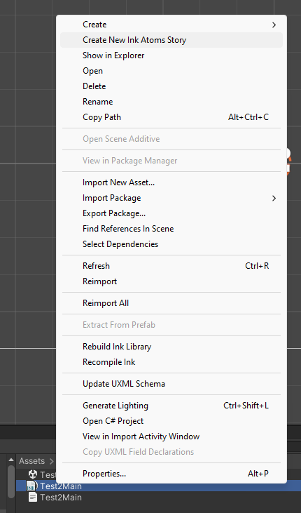
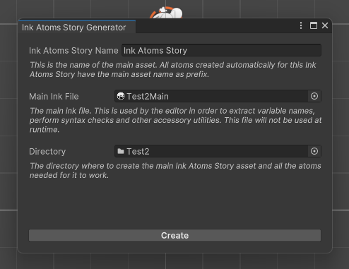
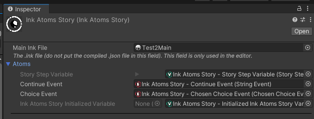

---
uid: initial
---
# Initial configuration

To create the necessary asset(s), right-click on the Ink story to manage and select "Create New Ink Atoms Story".

This will open the creation window, with a set of reasonable defaults. The meaning of each entry is described in the box itself.

The creation will trigger upon clicking "Create". This will create the main asset, an instance of @LemuRivolta.InkAtoms.InkAtomsStory, and also the set of all the necessary atoms. These atoms are visible under the "Atoms" foldout once the asset is created, and their purpose is explained in @base.

