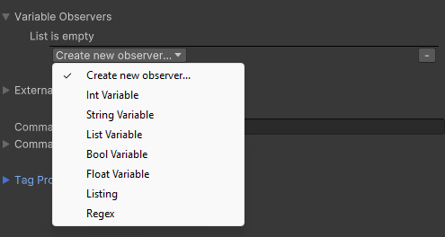
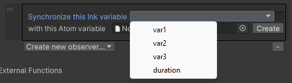
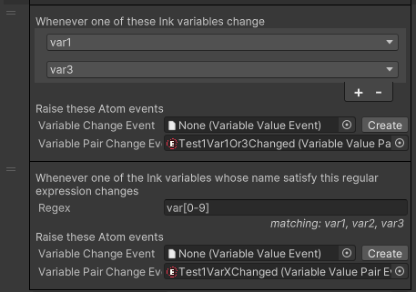

---
uid: variable-observers
---
# Variable Observers

One way to communicate between Unity and Ink projects is through **variables**. The Ink story can write relevant data into variables that will be read by the game to display it in some form, or the game can write data into the ink variables to inform the story about data and interactions that happen on the Unity side.

The main interface is the **Variable Observers** foldout. A variable observer is a component that listens to changes in a variable and reads (or synchronizes) variable values between Ink and Unity. There are multiple ways to handle variables, each of which can satisfy different needs.

The way to create a variable observer is to use the **Create new observer...** dropdown from the Variable Observers section.

## Int, String, Bool, List and Float Variable

This is the simplest way to interact with variables. With this kind of observer you can synchronize the value of an Ink variable with an Atom variable, meaning that every change in the Ink variable will cause a change in the Atom one, and vice versa.

This method could be used for example to synchronize the number of life points of the main character between Ink (where it can be used to make decisions in the story) and Unity (where it's displayed on the user interface and changed).

When such an observer is created, you can choose the Ink variable to synchronize and choose (or create) the corresponding Atom on Unity side. Only global variables can be synchronized, and by default only variables of the correct type are displayed (based on the value they're initialized on Ink's side).

By using the checkbox near the name selection, all global variables are displayed, even those with the wrong type, but be careful because this will almost certainly cause typing errors.

### Typing and conversions

Ink is weakly typed, meaning that variables have types that are not explicitely declared, which are checked only at runtime and that can change during execution.

This is not true of C#. Because of this, Unity Atoms are strongly typed, and they expect Ink's value to always have the same type (which is also a good general guideline to keep).

The only automatic conversion that is allowed is that an int value on the Ink side can be saved in a float variable on the Unity side.

## Listing and Regex

These observers listen to multiple variables at once, either by specifying a regular expression that matches with the variable name, or by providing an explicit list of variables to observe.

Since there are multiple variables listened at once, an Atom Event is raised at every change, but no value is synchronized with atoms. Two different events are provided:

- *Variable Change Event* only provides the new value of the variable changed
- *Variable Pair Change Event* provides both the new and the old value

In both cases, the event raised is a @LemuRivolta.InkAtoms.VariableValue, which contains both the variable name and its value (as an `object`).